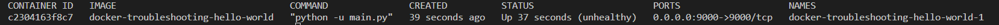

# Docker Troubleshooting

The Docker app hello-world when deployed is unhealthy!  Troubleshoot and implement to a healthy deployment.

Instructions
- Fork this repository
- Run the microservice locally, Assess, identify and resolve the problem with the app
- Create a pull request against the upsteam repository with the fix

# Local Development
- [Docker](https://docs.docker.com/engine/install/)
- curl
